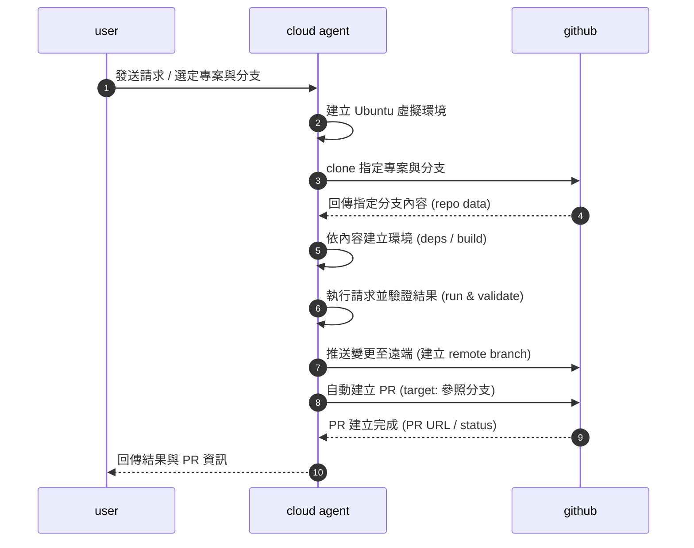

```mermaid
%%{init: {
  "sequence": {
    "width": 180,
    "height": 60,
    "actorMargin": 70,
    "messageMargin": 45,
    "messageAlign": "left",
    "labelBoxWidth": 80,
    "labelBoxHeight": 30
  }
}}%%
sequenceDiagram
    autonumber
    participant U as user
    participant CA as cloud agent
    participant GH as github

    U->>CA: 發送請求 / 選定專案與分支
    CA->>CA: 建立 Ubuntu 虛擬環境
    CA->>GH: clone 指定專案與分支
    GH-->>CA: 回傳指定分支內容 (repo data)
    CA->>CA: 依內容建立環境 (deps / build)
    CA->>CA: 執行請求並驗證結果 (run & validate)
    CA->>GH: 推送變更至遠端 (建立 remote branch)
    CA->>GH: 自動建立 PR (target: 參照分支)
    GH-->>CA: PR 建立完成 (PR URL / status)
    CA-->>U: 回傳結果與 PR 資訊
```
